<h1 align="center">WorldSlider</h1>
<p align="center"><strong>Generating Parallel Worlds of a Flight</strong></p>

<p align="center">
  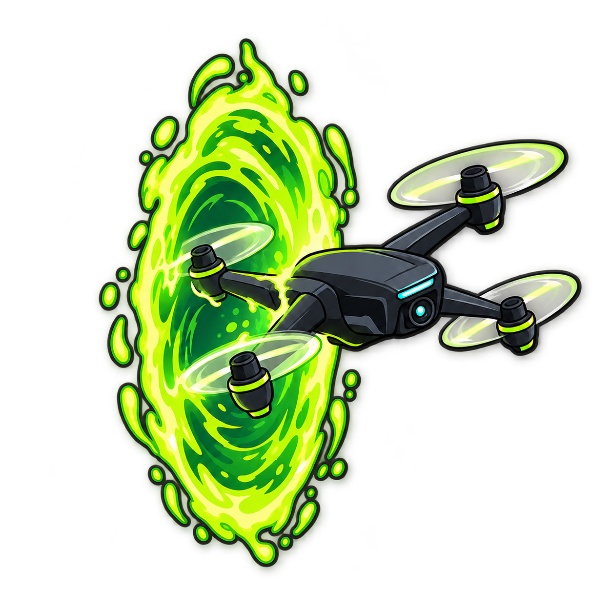
</p>

<p align="center">
  <em>"What if you could slide into a thousand different worlds? … you're the same person, but everything else is different?"</em><br>
  — Quinn Mallory, <em>Sliders</em>
</p>

WorldSlider generates videos that fly a prescribed trajectory through any world. This page collects the examples behind the paper, keyed to its sections — pick a card to jump to it:

<table align="center">
<tr><td align="center" width="25%"><a href="#comparison-with-camera-controlled-video-generation">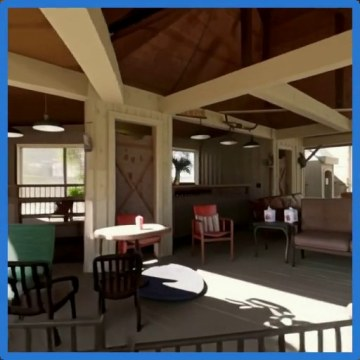</a></td><td align="center" width="25%"><a href="#parallel-worlds-along-a-prescribed-flight">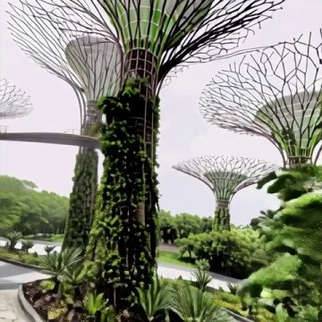</a></td><td align="center" width="25%"><a href="#trajectory-conditioned-branching-from-a-shared-observation">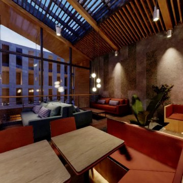</a></td><td align="center" width="25%"><a href="#visual-diversification-for-flight-policies">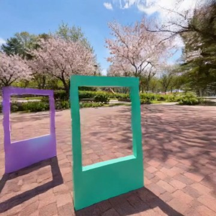</a></td></tr>
<tr><td align="left" valign="top" width="25%"><b><a href="#comparison-with-camera-controlled-video-generation">Trajectory following vs. baselines</a></b></td><td align="left" valign="top" width="25%"><b><a href="#parallel-worlds-along-a-prescribed-flight">One maneuver, many worlds</a></b></td><td align="left" valign="top" width="25%"><b><a href="#trajectory-conditioned-branching-from-a-shared-observation">Trajectory as action</a></b></td><td align="left" valign="top" width="25%"><b><a href="#visual-diversification-for-flight-policies">Downstream: drone data augmentation</a></b></td></tr>
<tr><td align="left" valign="top" width="25%"><sub>§4.1 · Appendix A.1</sub></td><td align="left" valign="top" width="25%"><sub>§4.2 · Appendix A.2</sub></td><td align="left" valign="top" width="25%"><sub>§4.2</sub></td><td align="left" valign="top" width="25%"><sub>§4.2 · Appendix A.3</sub></td></tr>
<tr><td align="left" valign="top" width="25%"><sub>How closely each camera-controlled generator follows a prescribed flight, against five baselines</sub></td><td align="left" valign="top" width="25%"><sub>The same aerobatic trajectory generated in different worlds</sub></td><td align="left" valign="top" width="25%"><sub>Alternative futures from one observation: the flight acts as the action input of a world model</sub></td><td align="left" valign="top" width="25%"><sub>Multiplying gate-traversal training data for policy learning while keeping every action label valid</sub></td></tr>
</table>

<p align="center"><sub>Four examples of what a trajectory-preserving generator enables; the space of applications is much larger than what fits here.</sub></p>

Consider a flight through a polar research station. The same flight can be revisited under a rose-colored sky, or transferred altogether to a tropical reservoir. The illumination, geometry, and identity of the scene change, yet the flight advances, banks, and turns with the same rhythm. We study the problem of generating these **parallel worlds of a flight**: visually distinct videos that all fly one prescribed trajectory.

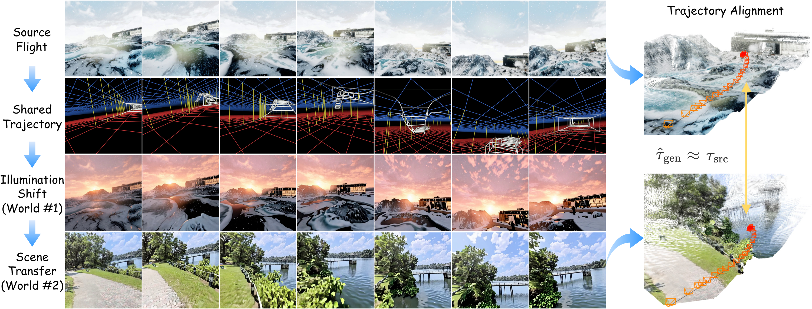

*Rows: the source flight, the shared trajectory rendered as FlightGrid, an illumination shift (world #1) and a scene transfer (world #2). Columns are synchronized timesteps. At right, the trajectory recovered from each generated video aligns with the source trajectory.*

<p align="center">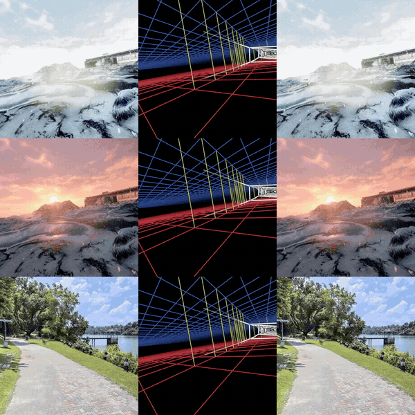</p>

*The same three worlds, moving. Each row shows the frozen first frame, the FlightGrid it follows, and the resulting video — the source flight on top, the sunset revisit and the reservoir transfer below.*

## Comparison with camera-controlled video generation

<sub>Paper: §4.1 Flight Fidelity and Generalization · Appendix A.1 Additional Flight Comparisons</sub>

All methods are evaluated under a common protocol, with every output rescored by the same ViPE and Q-Align pipeline. On standard trajectories, translation error is comparable across the strongest methods, while rotation error already separates. On the held-out diverse flights the methods separate decisively: every baseline falls between 20° and 27° mean geodesic rotation error, whereas WorldSlider attains 6.65° at four denoising function evaluations rather than 25 or 50.

| Method | Params. | NFE | Standard Rot. ↓ | Standard Trans. ↓ | Diverse Rot. ↓ | Diverse Trans. ↓ | Quality ↑ |
|---|---|---|---|---|---|---|---|
| MotionCtrl | 2B | 25 | 11.28 | 0.234 | 27.04 | 0.441 | 3.20 |
| CameraCtrl | 2B | 25 | 5.67 | 0.099 | 26.72 | 0.471 | 3.15 |
| RealCam-I2V | 1.4B | 25 | 7.62 | 0.132 | 24.37 | 0.428 | 2.76 |
| Wan2.1-Camera | 1.3B | 50 | 5.31 | 0.097 | 26.49 | 0.410 | 3.22 |
| HY-WorldPlay | 5B | 4 | 4.11 | 0.152 | 19.93 | 0.378 | 3.53 |
| **WorldSlider** | 2B | 4 | **2.52** | **0.079** | **6.65** | **0.101** | 3.45 |

*Rotation is the mean geodesic error in degrees; translation is the mean scale-normalized trajectory error; quality is the mean Q-Align score over both splits. NFE counts denoising function evaluations. Standard: 50 RealEstate10K trajectories; Diverse: 50 TartanAir-V2 flights.*

### All six methods on the same flight

Seven examples, four from the standard split and three from the diverse-flight split. In each 2×4 panel, the first column shows the input FlightGrid (top) and the prescribed flight in black with every method's recovered trajectory (bottom); the six outputs are resampled to the same 9.3 s and play in step. Each panel is labelled with its method; the label colour, the panel border and the curve in the trajectory plot share one colour per method:

 prescribed flight &nbsp;  **WorldSlider (ours)** &nbsp;  HY-WorldPlay &nbsp;  Wan2.1-Cam &nbsp;  CameraCtrl &nbsp;  MotionCtrl &nbsp;  RealCam-I2V

**Beamed great room** (RealEstate10K)

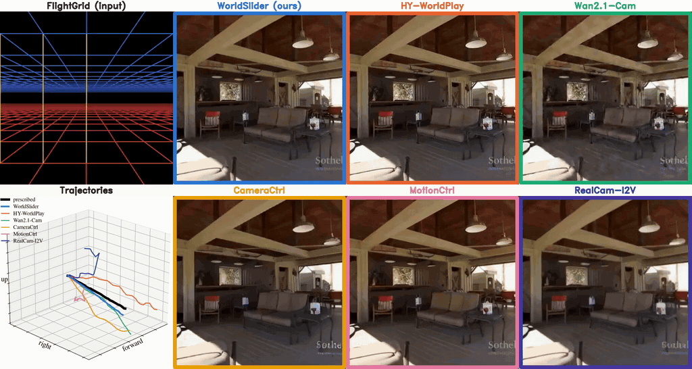

**Green-door living room** (RealEstate10K)

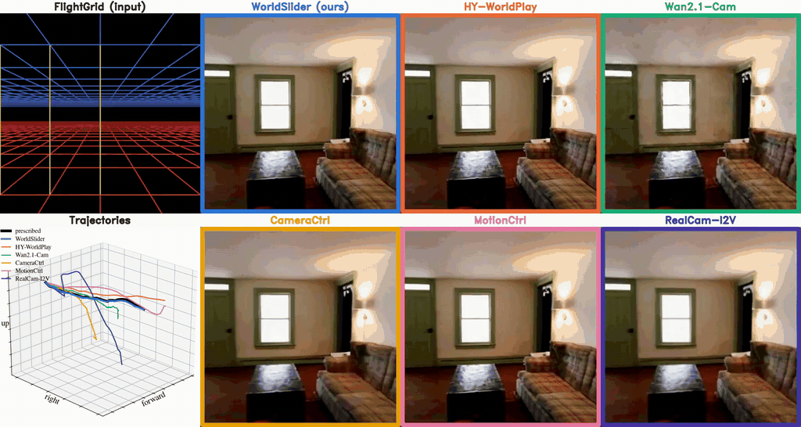

**Brick entrance** (RealEstate10K)

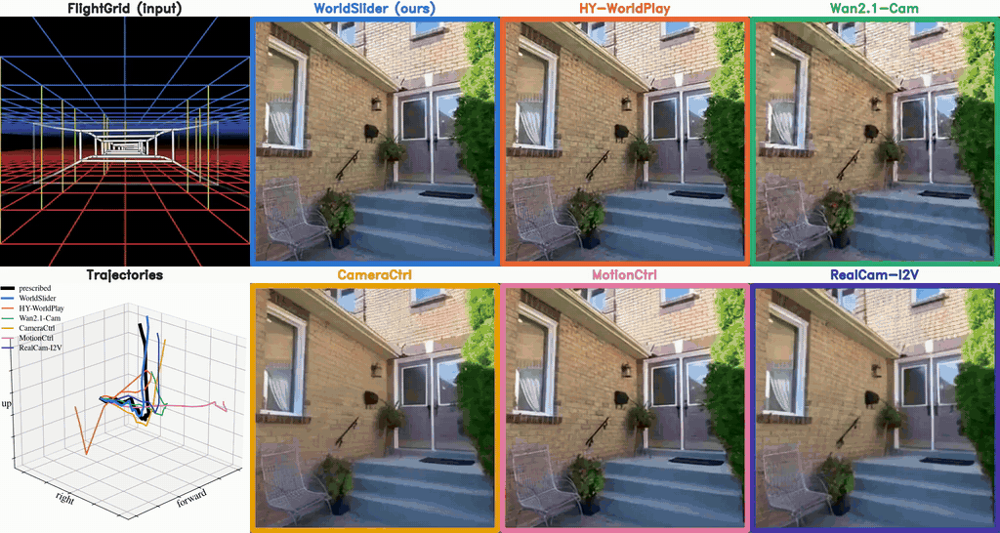

**Covered porch** (RealEstate10K)

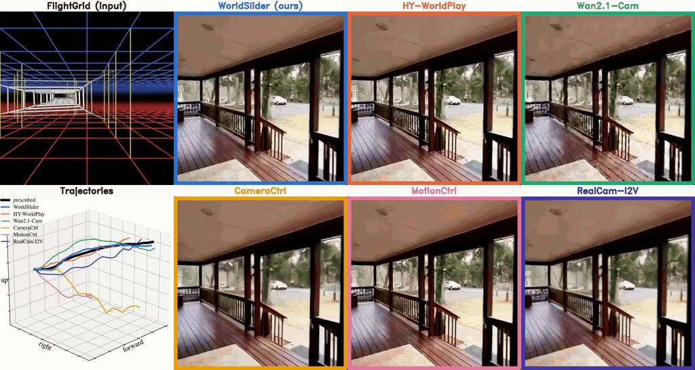

**Castle fortress** (TartanAir-V2)

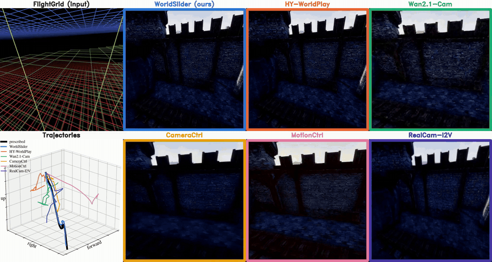

**Gothic island** (TartanAir-V2)

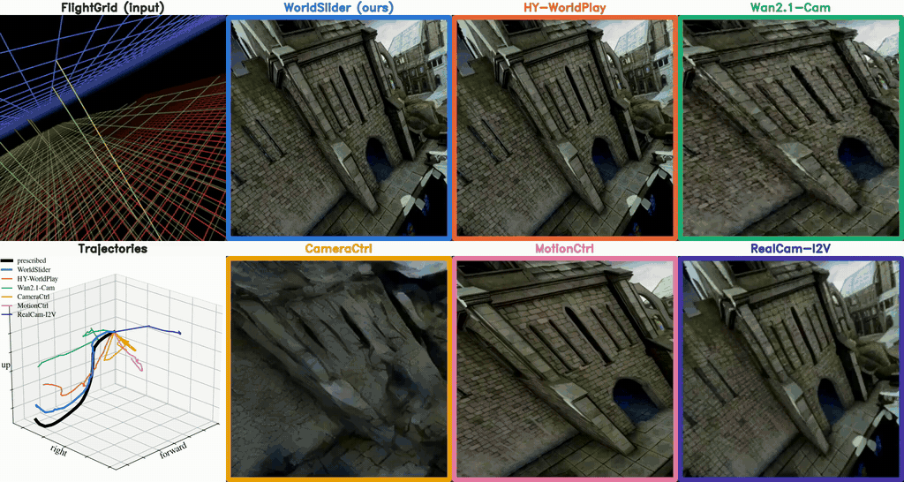

**Spring forest** (TartanAir-V2)

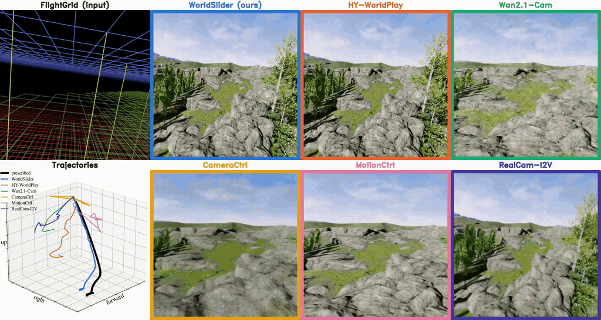

Full-resolution mp4s: [`assets/mp4/`](assets/mp4/).

---

## Parallel worlds along a prescribed flight

<sub>Paper: §4.2 Parallel Worlds and Applications · Appendix A.2 Parallel Worlds</sub>

The two flights below are specified as trajectories rather than extracted from recordings: a falling-leaf descent and a lazy eight. Each is rendered as FlightGrid and paired with two text conditions naming different target worlds. Between the two generated panels only the world changes; descent rate, roll and the onset of each turn are preserved, since both are conditioned on the same control.

| | |
|---|---|
| 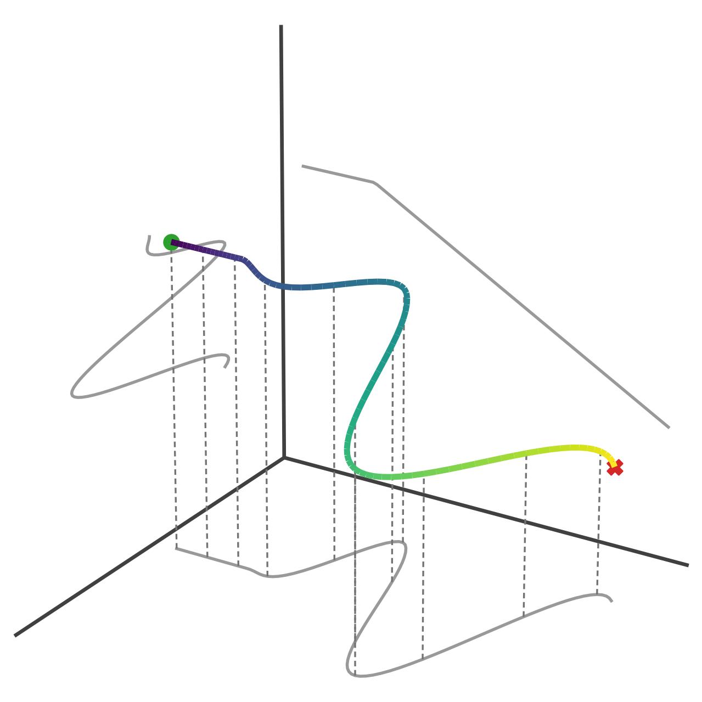 | **Falling leaf** — FlightGrid · Office · Waterfront skyline<br>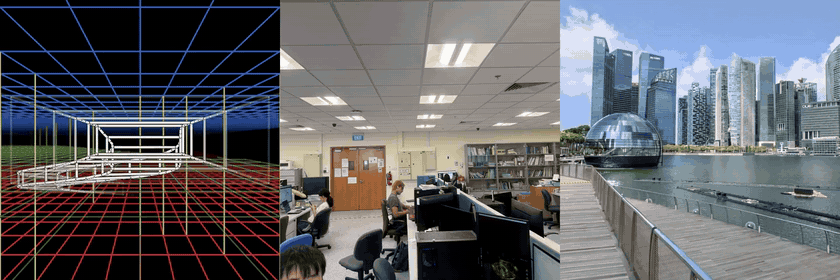 |
| 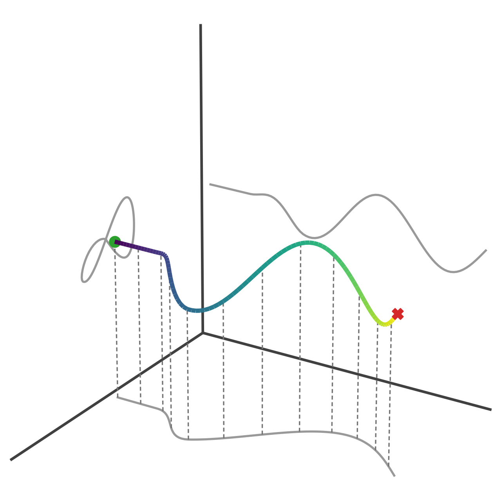 | **Lazy eight** — FlightGrid · Botanical dome · Shopping boulevard<br>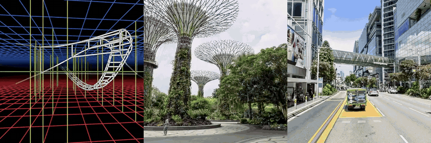 |

### Further flights in three worlds each

One prescribed flight, three worlds; only the first frame and the text change. Left: the prescribed trajectory. Panels: **FlightGrid (input) · world 1 · world 2 · world 3**.

| | |
|---|---|
| 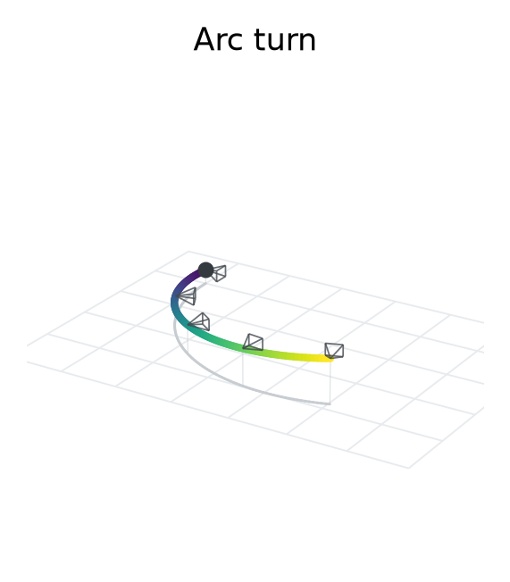 | **Arc turn** — Old town · Living room · Log cabin<br>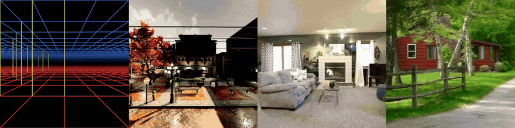 |
| 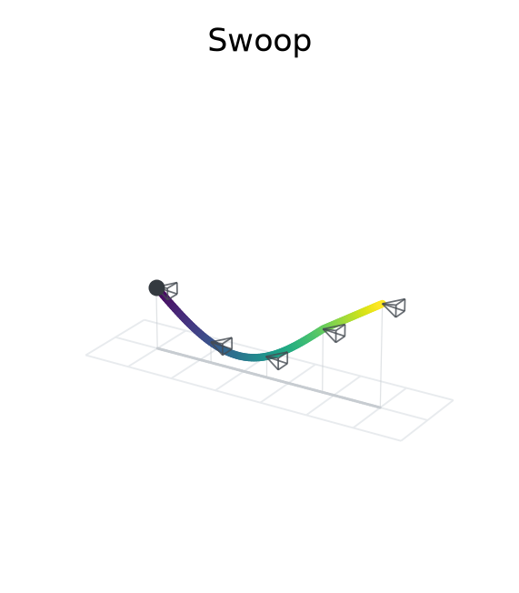 | **Swoop** — Living room · Retro office · Sewer<br>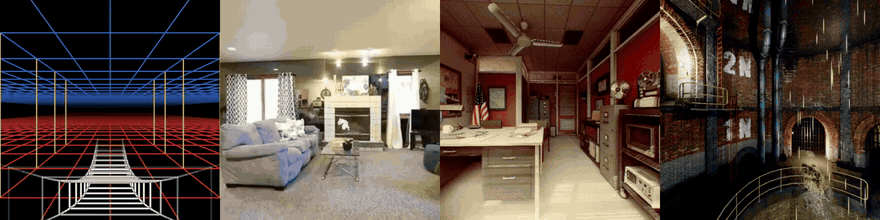 |
| 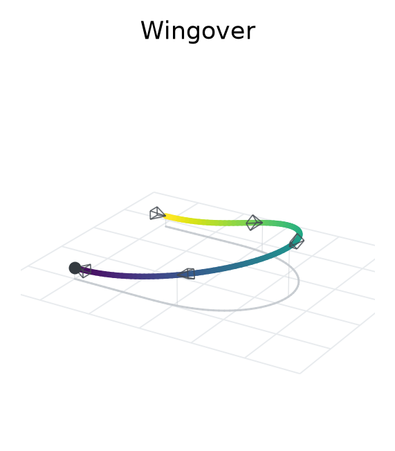 | **Wingover** — Diner · Restaurant · Sewer<br>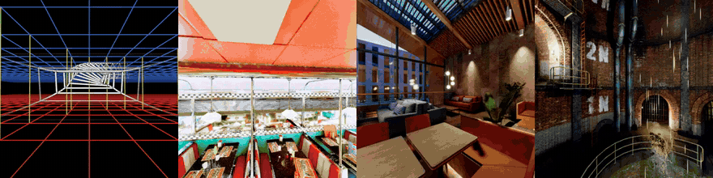 |
| 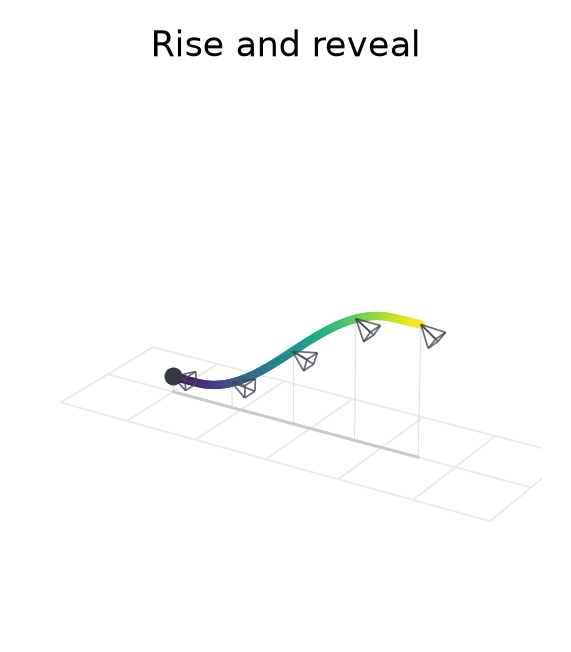 | **Rise and reveal** — Restaurant · Retro office · Kitchen<br>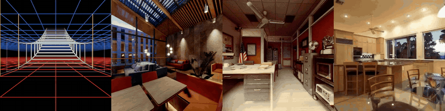 |

---

## Trajectory-conditioned branching from a shared observation

<sub>Paper: §4.2 Parallel Worlds and Applications</sub>

The construction inverts. Both branches below are conditioned on a single observation — the frame at left — and on two FlightGrids that diverge in heading. Each branch synthesizes a world consistent with that shared observation while revealing only the region its own trajectory traverses.

Panels: **Shared first frame · Turn left (FlightGrid, generated) · Turn right (FlightGrid, generated)**

**Street scene** — divergent headings from a single street-level observation.

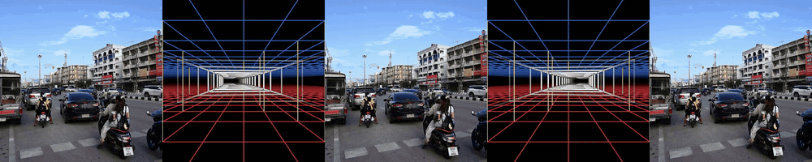

**Restaurant interior** — divergent headings from a single interior observation.

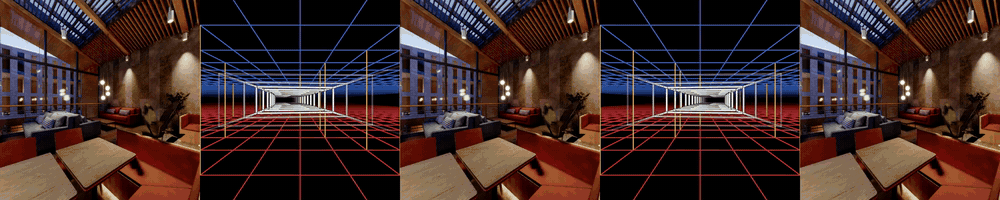

---

## Visual diversification for flight policies

<sub>Paper: §4.2 Parallel Worlds and Applications · Appendix A.3 Visual Diversification</sub>

Because a parallel world preserves the trajectory that generated it, the action labels of the source flight remain valid in the synthesized video. Simulator domain randomization varies illumination, gate appearance and background; WorldSlider instead generates complete, task-consistent environments around a fixed flight, which we term **visual diversification**. In Isaac Sim we build a three-gate direct course, a three-gate loop and a four-gate direct course, and collect 20 expert trajectories per course. An imitation-learning policy maps egocentric RGB observations to short waypoint sequences executed by a low-level controller; its architecture, trajectory labels and training budget are held fixed while only the observations vary. The original condition repeats each demonstration ten times; simulator randomization and WorldSlider instead provide ten visual variants of every demonstration, so every condition trains on 200 sequences per course with identical trajectory supervision. For every condition and course, five policies are each evaluated over 20 rollouts; a rollout succeeds only if all gates are traversed without collision. WorldSlider attains the highest success rate throughout and exceeds simulator randomization by 28 percentage points on the three-gate loop course.

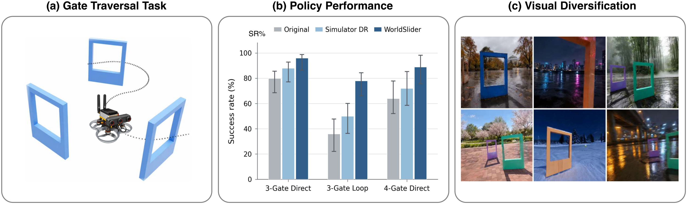

*(a) Gate traversal. (b) Policy success under the three training conditions. (c) Task-consistent worlds generated from the same flight.*

### Policy rollouts

| 3-gate direct | 3-gate loop | 4-gate direct |
|---|---|---|
| 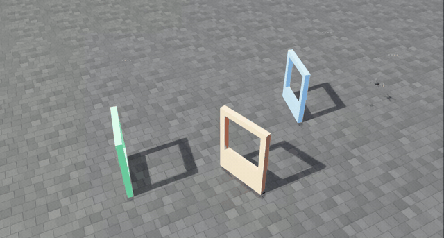 | 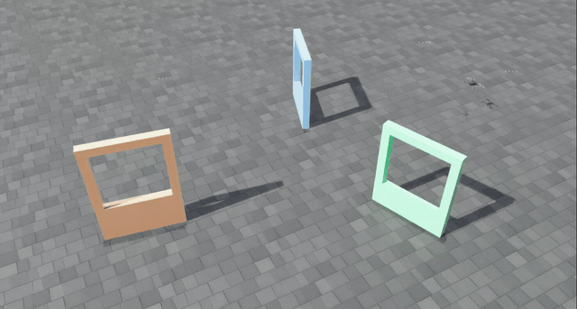 | 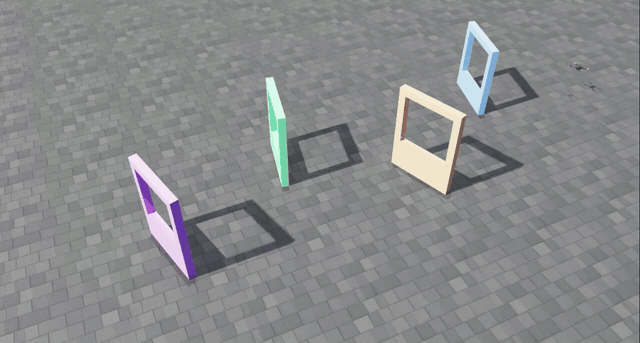 |

### Diversified gate flights

Recorded gate flights are re-rendered in new worlds from an edited first frame while the gate geometry and the flight are preserved. Each clip shows **original (left) · diversified (right)**, frame-aligned.

<table>
<tr><td width="50%"><b>Underground parking garage</b></td><td width="50%"><b>Container port at night</b></td></tr>
<tr><td width="50%">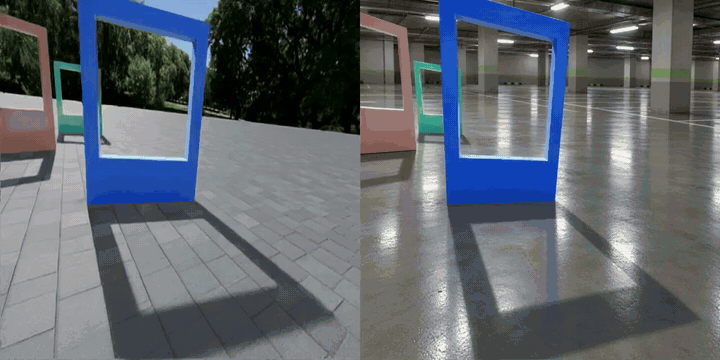</td><td width="50%">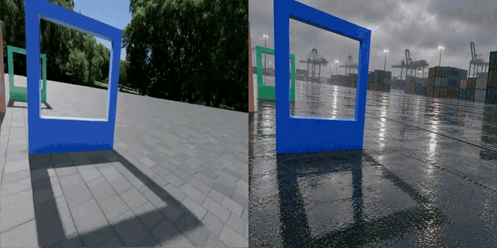</td></tr>
<tr><td width="50%"><b>Spring wildflower meadow</b></td><td width="50%"><b>Rainy autumn plaza</b></td></tr>
<tr><td width="50%">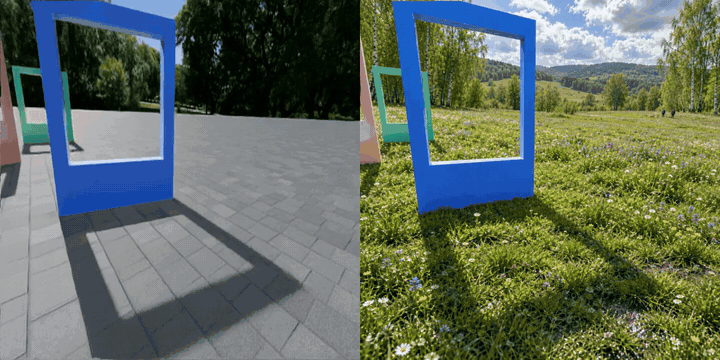</td><td width="50%">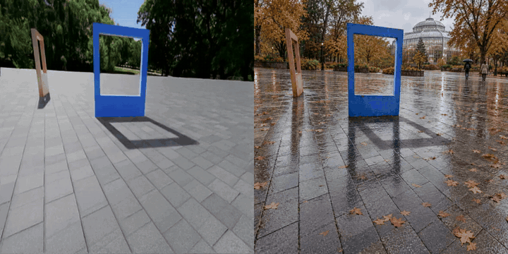</td></tr>
<tr><td width="50%"><b>Tropical terrace after rain</b></td><td width="50%"><b>Snowy field under a full moon</b></td></tr>
<tr><td width="50%">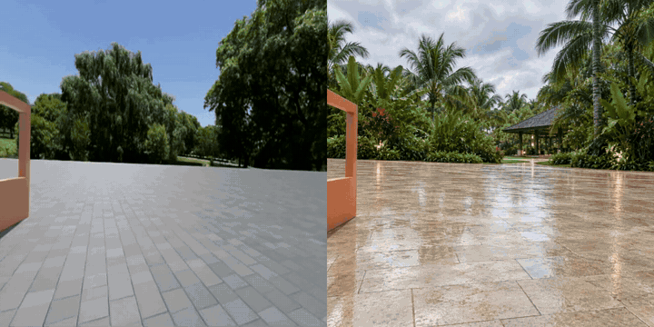</td><td width="50%">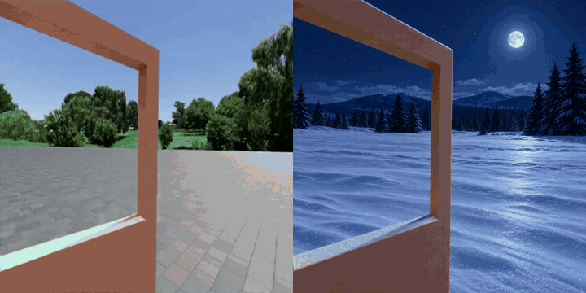</td></tr>
<tr><td width="50%"><b>Aircraft hangar</b></td><td width="50%"><b>Misty bamboo forest</b></td></tr>
<tr><td width="50%">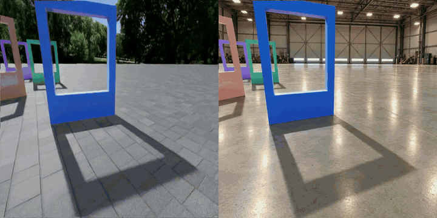</td><td width="50%">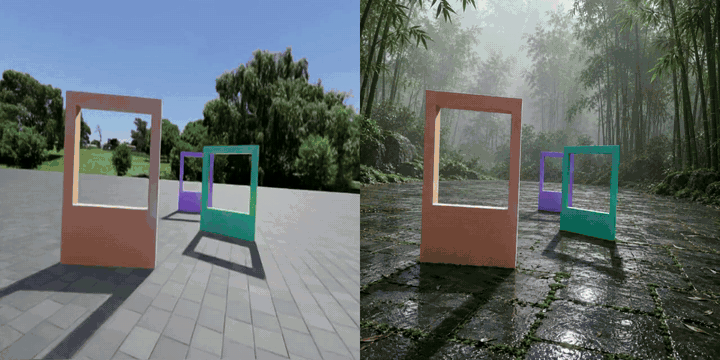</td></tr>
<tr><td width="50%"><b>Running track at night</b></td><td width="50%"><b>Cherry-blossom park</b></td></tr>
<tr><td width="50%">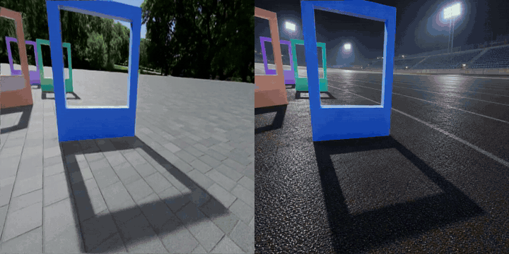</td><td width="50%">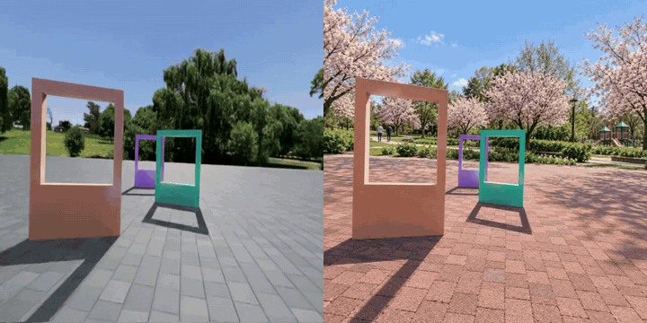</td></tr>
</table>

---

## Code

<sub>Paper: §3 Method</sub>

A minimal release of the WorldSlider-specific code is in [`code/`](code/README.md): the FlightGrid renderer (poses → appearance-free control video), the control-input hook for Cosmos-Transfer2.5, the three training stages (control adaptation, 4-step DMD distillation, reward-weighted DMD from recovered trajectories), the geometry reward, a dataset builder and a generation script. Rendering FlightGrid needs only NumPy, OpenCV and ffmpeg:

```bash
python -m worldslider.flightgrid.render poses.txt flightgrid.mp4 --fov 90 --fps 10 --frames 93
```
